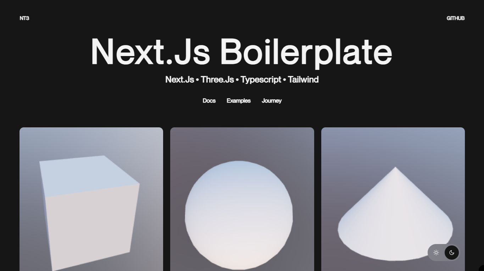

<a href="https://github.com/whosramoss/nt3">
  
  <h1 align="center">NT3</h1>
</a>

<p align="center">
  This template provides a starting point for building Next.js apps with Tailwind CSS, TypeScript and Three.js.
</p>

<div align="center">
  
  
  
  
  
  <br/>
  
  
  
   
</div>
<br/>

<br/>

## How to install

```bash
  # Clone the project
  git clone https://github.com/whosramoss/nt3/

  # Go to the project directory
  cd nt3

  # Install dependencies
  npm install

  # Start the server
  npm run dev
```

## How to build

- Before generating the build, don't forget to update the [layout](./src/app/layout.tsx) file and set `isLocalMetadata = false`.
- To generate a static compilation, the [next.config.mjs](./next.config.mjs) file must have the object below :

```bash
const staticbuild = {
  distDir: 'build',
  output: 'export',
  trailingSlash: true,
}
```

- Run the command:

```bash
  npm run build
```

## Project Structure Overview

```bash
src/
├── app/
├── hooks/
├── models/
├── providers/
├── styles/
├── ui/
├── utils/
└── middleware
```

| Name        | Summary                                             | Description                                                                                                                                                                                                                                                 |
| ----------- | --------------------------------------------------- | ----------------------------------------------------------------------------------------------------------------------------------------------------------------------------------------------------------------------------------------------------------- |
| `src`       | Root Source Folder                                  | The `src` folder is where all the source code for the React application resides. It contains various subfolders, each with a specific purpose related to the architecture of the project.                                                                   |
| `app`       | Pages, Layouts, and API Routes                      | The `app` folder is typically used for organizing the core pages and layouts of the application, as well as handling API routes if you're using Next.js or a similar framework with server-side capabilities.                                               |
| `hooks`     | Custom Hooks                                        | The `hooks` folder contains all the custom React hooks used throughout the application. Custom hooks allow you to encapsulate logic that can be reused in multiple components, keeping your code DRY (Don’t Repeat Yourself).                               |
| `models`    | Data Models and Type Definitions                    | The `models` folder is often used to define TypeScript types, interfaces, or any models that are used to represent the data in your application.                                                                                                            |
| `providers` | Context Providers                                   | The `providers` folder typically contains context providers for managing global state using React Context API. This is useful for sharing state or logic across different components without passing props down through every level of the component tree.  |
| `styles`    | CSS/SCSS, Styled Components                         | The `styles` folder is used to store all the styles for the application. Depending on your styling approach.                                                                                                                                                |
| `ui`        | Reusable UI Components                              | The `ui` folder contains reusable components that make up the user interface of your application. These are generally smaller, focused components that can be used across different pages and sections of the app.                                          |
| `utils`     | Utility Functions, Constants, Enums, and Interfaces | The `utils` folder contains utility functions, constants, enums, and interfaces that are used throughout the application. These are helper files that contain code that is not tied to any specific component but is used across the app for various tasks. |

## Framework and Packages

- [Next.js](https://nextjs.org/)
- [TypeScript](https://www.typescriptlang.org/)
- [Prettier](https://prettier.io/)
- [ESLint](https://eslint.org/)
- [Tailwind CSS](https://tailwindcss.com/)
- [Framer Motion](https://framer.com/motion)
- [Zod](https://zod.dev/)

## Hooks

- [useAnimationCursor](./src/hooks/useAnimationCursor.ts)
- [useAnimationFadeIn](./src/hooks/useAnimationFadeIn.ts)
- [useApiFetchFromQuery](./src/hooks/useApiFetchFromQuery.ts) (Using [React-Query](https://www.npmjs.com/package/react-query))

## Contributing

If you want to contribute to `nt3`, please make sure to review the [contribution guidelines](https://github.com/whosramoss/nt3/blob/master/CONTRIBUTING.md). This project makes use of [GitHub issues](https://github.com/whosramoss/nt3/issues) for
tracking requests and bugs.

## License

MIT License. [LICENSE](./LICENSE)

## Author

Gabriel Ramos ([@whosramoss](https://github.com/whosramoss))
